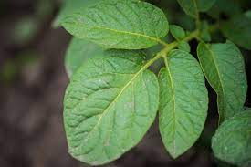
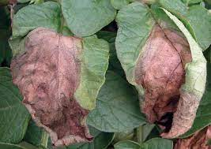

# Potato-Disease-Classification
## Problem Statement
Brown patches on potato leaves indicate a disease called blight. These can be avoided by treatment. Depending on whether it is early blight or late blight, the method of treatment varies. The motivation of this project is to provide farmers with an easy way to identify the type of disease so that they will be able to give the appropriate treatment to the crops. 

| 
||:--:|
| <b>Healthy Leaf</b>|

||:--:|
| <b>Early Blight</b>|

||:--:|
| <b>Late Blight</b>|
